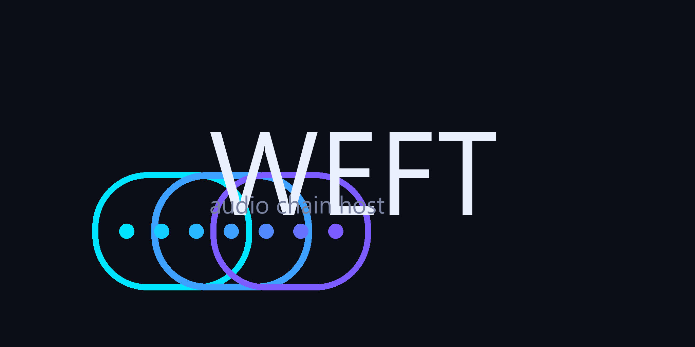

# Weft

**Weft** — a C++ audio-plugin chain host: load VST 2 / VST 3 plugins into an
ordered processing chain, drive every parameter live over **OSC**, describe the
whole setup in a small **JSON** config, and run it offline from a CLI.

> *Weft*: the longitudinal threads in weaving that the warp threads interlace
with — here, the plugins whose signals are interlaced into one chain.



---

## Status

| Layer | What it is | State |
|---|---|---|
| `core/` | Platform-agnostic C++17 library: param model, chain, JSON config, OSC wire + addressing, UDP transport | **building & tested** (27/27 test cases green) |
| `host/` | JUCE-based VST3 wrapper backend + `weft_smoke` introspection CLI + `weft-render` offline CLI | **building & CI-tested** |
| `cli/` | Offline audio→audio CLI (`weft-render`) with per-slot JSON params | **building & CI-tested** |

Progress is tracked in [STATUS.md](STATUS.md).

## What Weft does

1. **Chains VST2/3 plugins** in an ordered processing graph.
2. **Loads per-plugin / per-param default values from JSON** — one config file
   describes the whole rig, versionable and diff-able.
3. **Live-updates the chain** when any param changes at runtime (hot-apply:
   unchanged plugins are never reloaded).
4. **Queries all params** from each loaded plugin (normalized surface with
   name, id, range, steps, kind).
5. **Exposes dynamic per-param control over OSC** — set by *name* or by *id*,
   reset per-slot or global, re-load config by path or JSON blob, and receive
   `/change/...` pushes when a plugin changes its own params.

Architecture decision (user-directed): the **inner VST wrapper only describes
the param interface**; the **outer app owns the OSC transport**. The core
library never links a plugin SDK.

## Quick start (no compilation)

Prebuilt `weft-render` binaries for Windows x64, Linux x64 and macOS
(arm64 + Intel) are published on every [release](../../releases). Grab the
zip/tarball for your platform, unpack, and:

```sh
./weft-render input.wav chain.json output.wav --bits 16
```

That's the whole UX: one input WAV, one JSON config (see
[examples/chain.json](examples/chain.json) for the shape — each slot names a
VST3 file and its `params`), one output WAV at the input's sample rate.

> The plugin paths in the config point at *your* VST3 files — Weft ships
> without any third-party plugins.

## Building the core (local)

Requires CMake ≥ 3.16 and a C++17 compiler (tested: MSYS2 ucrt64 g++ 16, cmake 4.4).

```sh
cmake -S . -B build -DCMAKE_BUILD_TYPE=Release
cmake --build build -j4
cd build && ctest --output-on-failure
```

Third-party headers (`nlohmann/json`, `doctest`) are vendored under
`third_party/` — no network access needed to build.

CI runs the same steps on GitHub Actions (see `.github/workflows/ci.yml`).

## Building the host + render CLI

The JUCE host layer is opt-in (it fetches JUCE 8.0.4 at configure time, so
core-only builds stay network-free):

```sh
cmake -S . -B build -DCMAKE_BUILD_TYPE=Release -DWEFT_BUILD_HOST=ON
cmake --build build -j4 --target weft_smoke weft-smoke-plugin_VST3 weft-render
```

> JUCE 8 dropped MinGW, so the host layer builds on MSVC (Windows), AppleClang
> (macOS) and Clang/GCC (Linux) — CI covers all three. The core library
> still builds on MSYS2 MinGW.

## Rendering offline (audio → audio)

`weft-render` reads a WAV, runs it through the chain described by a JSON
config, and writes a WAV. No resampling — the output keeps the input's sample
rate (must be a standard 8k–384k rate) and no audio device is touched.

```sh
weft-render input.wav chain.json output.wav [--bits 16|24|32] [--version]
```

- The chain comes from the config's `chain` array; each slot's `params`
  block is **pushed onto the live plugin instance**, so a config fully
  determines the render (deterministic, reproducible, diff-able).
- `--bits 16|24|32` picks the output bit depth (default **32 = 32-bit float
  WAV**, lossless for the float chain; 16/24 are plain integer conversion,
  no dither).
- Slots with `enabled: false` pass audio through untouched; an empty chain is
  a passthrough.
- Mono input is upmixed to stereo; output channel count is the widest slot's
  bus width.

The VST3 plugin path in the config is resolved relative to the current
working directory (absolute paths work too). See
[docs/CONFIG.md](docs/CONFIG.md) for the full schema and [examples/chain.json](examples/chain.json).

## Layout

```
weft/
├── core/
│   ├── include/weft/
│   │   ├── param.hpp      # Param / ParamSet model
│   │   ├── chain.hpp      # Chain + IPluginBackend
│   │   ├── config.hpp     # JSON config parse/dump/merge
│   │   ├── osc.hpp        # OSC 1.0 wire codec + /chain addressing
│   │   └── osc_io.hpp     # UDP OSC transport
│   ├── src/               # implementations
│   └── tests/             # targeted doctest suites
├── docs/                  # CONFIG.md, OSC.md, ARCHITECTURE.md
├── examples/chain.json    # example rig config
├── assets/logo/           # banner, avatar, mark
└── third_party/           # nlohmann/json.hpp, doctest.h (vendored)
```

## Documentation

- [docs/ARCHITECTURE.md](docs/ARCHITECTURE.md) — layering, backend contract, data flow
- [docs/CONFIG.md](docs/CONFIG.md) — JSON schema + merge semantics
- [docs/OSC.md](docs/OSC.md) — full OSC protocol reference

## Prior art

Weft is informed by (and deliberately distinct from):

- **ReaPlugga** (ReaPlugga/ReaPlugga on GitHub) — hosts VST2 plugins in a
  ReWire/ASIO context; no param-level OSC.
- **JUCE `AudioPluginHost` / HostPluginDemo** — reference hosting; Weft builds
  the host layer on JUCE hosting and adds the chain+OSC+config layer above it.
- **getdunne/juce-plugin-wrapper** — minimal JUCE VST wrapper as a starting
  point for the backend contract.

## License

Weft's own source is **MIT**-licensed (see [LICENSE](LICENSE)). The plugin
ecosystem is what you bring in — Weft neither bundles nor distributes any
third-party plugin. The host layer links **JUCE 8.0.4**, which is
dual-licensed **AGPL-3.0 / commercial**; JUCE is fetched at build time
(`FetchContent`, pinned by SHA256) and is not vendored into this repo.
Core-only use stays plain MIT; distributing the host layer requires a
commercial JUCE licence (or an AGPL-compliant distribution).
